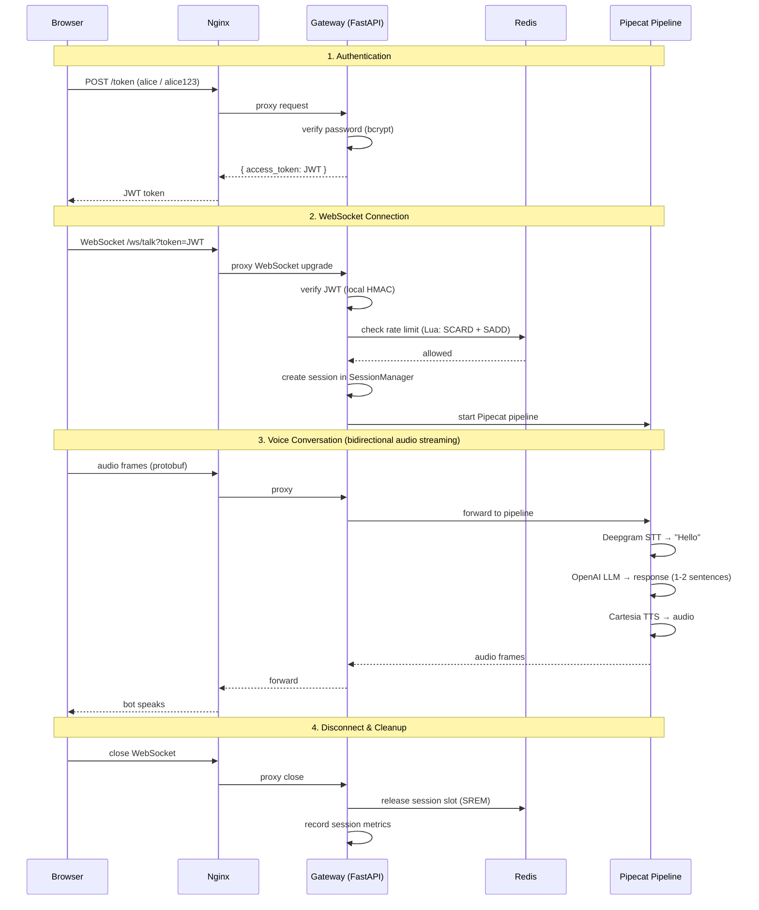

# ADIIVA Voice AI Gateway

A high-concurrency, multi-user Voice AI Gateway. Users authenticate via JWT, connect over WebSocket, and talk to an AI assistant powered by Deepgram (STT), OpenAI (LLM), and Cartesia (TTS) — all orchestrated through Pipecat pipelines.

Built with FastAPI, Redis, and a TypeScript client served via Nginx. Everything runs with one command via Docker Compose.

## Quick Start

```bash
git clone <repo-url>
cd adiiva
cp server/.env.example server/.env
# Fill in your API keys in server/.env
./start.sh
```

This will auto-generate a `JWT_SECRET`, build all containers, and start the app.

Open `http://localhost:5173`, login with a demo user, and click Connect.

## Demo Users

| Username | Password |
|---|---|
| alice | alice123 |
| bob | bob123 |
| charlie | charlie123 |

## Project Structure

```
adiiva/
├── server/                      # Backend — FastAPI + Pipecat
│   ├── src/
│   │   ├── app.py               # Gateway — auth, rate limiting, WebSocket endpoint
│   │   ├── pipeline.py          # Pipecat pipeline (STT → LLM → TTS) + Play Audio tool
│   │   ├── session_manager.py   # Maps WebSocket sessions to PipelineTask instances
│   │   ├── auth.py              # JWT creation and verification
│   │   ├── rate_limiter.py      # Redis-based per-user concurrency control
│   │   ├── metrics.py           # Latency tracking + histogram computation
│   │   ├── usage_tracker.py     # Per-session STT/LLM/TTS usage + cost estimation
│   │   └── user_store.py        # Demo user store with bcrypt
│   ├── static/
│   │   └── poem.wav             # Pre-recorded audio for Play Audio tool
│   ├── tests/
│   ├── Dockerfile
│   ├── pyproject.toml
│   └── .env.example
│
├── client/                      # Frontend — TypeScript + Vite + Nginx
│   ├── src/
│   │   ├── app.ts               # Login, WebSocket connect, audio, metrics panel
│   │   └── style.css
│   ├── nginx.conf               # Serves static files + reverse proxies to gateway
│   ├── Dockerfile
│   └── package.json
│
├── docker-compose.yaml          # 3 services: gateway, client, redis
├── start.sh                     # One-command startup
└── README.md
```

## How It Works

Here's what happens when a user opens the app and starts talking:



The key thing: once the WebSocket connects, audio flows directly between the browser and the Pipecat pipeline. The gateway handles auth and rate limiting upfront, then gets out of the way.

## What's Inside

### Authentication
JWT-based. Hit `POST /token` with username + password, get a token back. The token goes as a query param on the WebSocket upgrade (`/ws/talk?token=...`). Invalid or missing tokens get closed with code `4001`.

### Rate Limiting
Redis-backed concurrency cap — each user gets max 2 simultaneous sessions (configurable). Uses a Lua script for atomic check-and-set. If you exceed the limit, the WebSocket closes with code `4001` and the client shows a message.

### The Pipeline
Each session gets its own Pipecat pipeline:

**Deepgram** (STT) → **OpenAI** (LLM) → **Cartesia** (TTS)

The LLM keeps responses to 1-2 sentences, plain text only (no markdown — TTS would read the symbols aloud). It also has a `play_audio` tool that plays a pre-recorded poem when asked.

### Tool Calling — Play Audio
When the user asks for a poem or nursery rhyme, the LLM calls the `play_audio` tool. The gateway says "Sure, here's a poem for you" (via TTS filler speech), then streams raw PCM audio from a WAV file directly to the client — bypassing TTS entirely.

### Session Management
`SessionManager` maps active WebSocket connections to `PipelineTask` instances. Tracks per-session usage (STT seconds, LLM tokens, TTS characters) and computes cost estimates. On disconnect, the session summary gets recorded for the `/metrics` endpoint.

### Observability
- **`/metrics` endpoint** — Real-time latency histogram (min/max/mean/p50/p95/p99), active session usage, completed session history, per-session cost breakdown (STT/LLM/TTS)
- **Metrics panel in the client** — Polls `/metrics` every 3 seconds after login, renders tables with live data
- **Langfuse integration** (optional) — Set `ENABLE_TRACING=true` to export OpenTelemetry traces to Langfuse. Every pipeline processor (STT, LLM, TTS) emits spans with token counts and durations. Per-turn cost visibility on the Langfuse dashboard
- **Latency tracking** — Pipecat's `UserBotLatencyObserver` measures E2E TTFB per turn and logs per-service breakdowns (e.g., `DeepgramSTT=150ms | OpenAILLM=400ms | CartesiaTTS=100ms`)

### Cost Estimation
Each session tracks:
- **STT**: seconds of audio transcribed (Deepgram charges by duration)
- **LLM**: prompt + completion tokens (OpenAI pricing)
- **TTS**: characters synthesized (Cartesia pricing)

Dollar costs are estimated using provider rate constants and exposed via `/metrics` and in the client's metrics panel.

## Environment Variables

| Variable | Description |
|---|---|
| `DEEPGRAM_API_KEY` | Deepgram STT API key |
| `OPENAI_API_KEY` | OpenAI LLM API key |
| `CARTESIA_API_KEY` | Cartesia TTS API key |
| `JWT_SECRET` | JWT signing key (auto-generated by `start.sh`) |
| `REDIS_URL` | Redis connection URL (set automatically in Docker) |
| `MAX_CONCURRENT_SESSIONS` | Max concurrent sessions per user (default: 2) |
| `ENABLE_TRACING` | Enable OpenTelemetry tracing to Langfuse (default: false) |
| `OTEL_EXPORTER_OTLP_ENDPOINT` | Langfuse OTLP endpoint |
| `OTEL_EXPORTER_OTLP_HEADERS` | Langfuse auth header (Base64-encoded public:secret key) |

## API Endpoints

| Endpoint | Method | Description |
|---|---|---|
| `/token` | POST | Issue JWT token (query params: `user_id`, `password`) |
| `/ws/talk` | WebSocket | Voice AI session (query param: `token`) |
| `/health` | GET | Health check with active session count |
| `/metrics` | GET | Latency histograms, active/completed session usage, cost tracking |

## Development

### Running locally (without Docker)

```bash
# Terminal 1: Start Redis
docker compose up -d redis

# Terminal 2: Start the backend
cd server
cp .env.example .env   # fill in API keys
uv sync
uv run uvicorn src.app:app --host 0.0.0.0 --port 8000

# Terminal 3: Start the client
cd client
npm install
npm run dev
```

Open `http://localhost:5173`. The Vite dev server proxies API/WebSocket requests to the backend.

### Running tests

```bash
cd server
uv run pytest tests/ -v
```

## Scaling Strategy (5,000+ Concurrent Calls)

The current architecture runs everything in a single FastAPI process. To scale beyond that:

1. **Separate gateway from pipeline workers** — The gateway (auth, rate limiting, session routing) becomes a lightweight HTTP service. Pipeline workers are standalone processes, each running one Pipecat session. The gateway spawns workers and returns a direct WebSocket URL to the client — taking itself out of the audio path entirely.

2. **Horizontal scaling** — Run multiple gateway instances behind a load balancer. Workers scale independently based on demand. Redis remains the shared state layer for rate limiting and session tracking.

3. **Container orchestration** — Kubernetes or ECS for autoscaling workers based on active session count. Each worker pod runs one pipeline — a crash affects only one user.

4. **CDN for the client** — In production, the built client (static HTML/JS/CSS) goes on a CDN (CloudFront, Vercel). Zero compute cost, instant global delivery.

## Resilience — Circuit Breaker Logic

If an upstream AI provider (Deepgram, OpenAI, Cartesia) goes down or becomes slow:

1. **Per-provider timeouts** — Each service call has a deadline. If Deepgram doesn't respond in 5s, the turn is dropped rather than blocking the pipeline.

2. **Circuit breaker pattern** — After N consecutive failures to a provider, the circuit opens and requests fail fast for a cooldown period. This prevents cascading failures where a slow STT provider backs up the entire pipeline.

3. **Graceful degradation** — If TTS fails, the LLM response can be sent as text. If STT fails, the session stays open but pauses processing until the service recovers.

4. **Health checks** — The `/health` endpoint reports active session count. A load balancer can route away from unhealthy instances.

## Optimization — Minimizing Hot-Path Overhead

The hot path is: audio in → STT → LLM → TTS → audio out. Every millisecond counts.

1. **JWT verification is local** — HMAC validation, no Redis or network call. Happens once at WebSocket upgrade, never during audio streaming.

2. **Rate limiting is atomic** — Single Lua script on Redis (SCARD + SADD). One round-trip, no lock contention. Only checked at connection time, not per-frame.

3. **Gateway is not in the audio path** — After auth and session setup, audio flows directly between the browser and the Pipecat pipeline over WebSocket. The gateway does zero work during streaming.

4. **Pipecat's streaming architecture** — STT, LLM, and TTS run as pipeline processors with async frame passing. LLM tokens stream to TTS as they arrive — the bot starts speaking before the full response is generated.
