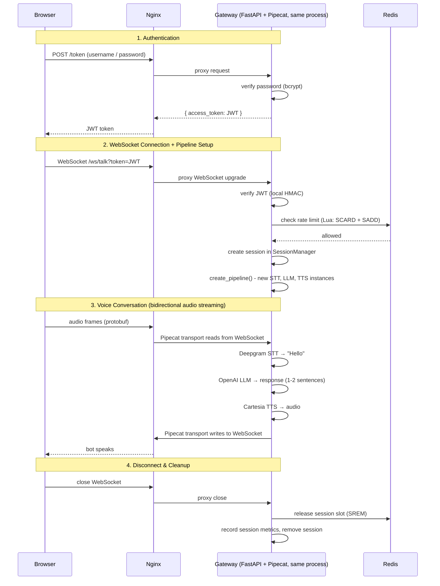

# ADIIVA Voice AI Gateway

A high-concurrency, multi-user Voice AI Gateway. Users authenticate via JWT, connect over WebSocket, and talk to an AI assistant powered by Deepgram (STT), OpenAI (LLM), and Cartesia (TTS), all orchestrated through Pipecat pipelines.

Built with FastAPI, Redis, and a TypeScript client served via Nginx. Everything runs with one command via Docker Compose.

## Quick Start

```bash
git clone <repo-url>
cd adiiva
cp server/.env.example server/.env
# Fill in your API keys in server/.env
./start.sh
```

This will auto-generate a `JWT_SECRET`, build all containers, and start the app.

Open `http://localhost:5173`, login with a demo user, and click Connect.

## Demo Users

| Username | Password |
|---|---|
| kalika | kalika@adiiva |
| robin | robin@adiiva |
| rohil | rohil@adiiva |

## Project Structure

```
adiiva/
├── server/                      # Backend - FastAPI + Pipecat
│   ├── src/
│   │   ├── app.py               # Gateway - auth, rate limiting, WebSocket, admin endpoints
│   │   ├── pipeline.py          # Pipecat pipeline (STT → LLM → TTS) + Play Audio tool
│   │   ├── session_manager.py   # Maps WebSocket sessions to metadata
│   │   ├── observers.py         # LatencyBreakdownObserver - per-turn latency collection
│   │   ├── metrics_store.py     # In-memory metrics store with SSE fan-out
│   │   ├── auth.py              # JWT creation and verification
│   │   ├── rate_limiter.py      # Redis-based per-user concurrency control
│   │   └── user_store.py        # Demo user store with bcrypt
│   ├── static/
│   │   ├── admin.html           # Admin dashboard - real-time session metrics via SSE
│   │   └── poem.wav             # Pre-recorded audio for Play Audio tool
│   ├── tests/
│   ├── Dockerfile
│   ├── pyproject.toml
│   └── .env.example
│
├── client/                      # Frontend - TypeScript + Vite + Nginx
│   ├── src/
│   │   ├── app.ts               # Login, WebSocket connect, audio playback
│   │   └── style.css
│   ├── nginx.conf               # Serves static files + reverse proxies to gateway
│   ├── Dockerfile
│   └── package.json
│
├── docker-compose.yaml          # 3 services: gateway, client, redis
├── start.sh                     # One-command startup
└── README.md
```

## How It Works

Here's what happens when a user opens the app and starts talking:



The gateway and the Pipecat pipeline run in the same FastAPI process. The `/ws/talk` handler acts as a per-session lifecycle manager: it authenticates, checks rate limits, creates an independent pipeline, and then `await`s until the session ends. Pipecat's `FastAPIWebsocketTransport` takes over the WebSocket for all audio I/O, so the gateway handler itself does no work during streaming, but the process and event loop are shared across all sessions.

## What's Inside

### Authentication
JWT-based. Hit `POST /token` with username + password, get a token back. The token goes as a query param on the WebSocket upgrade (`/ws/talk?token=...`). Invalid or missing tokens get closed with code `4001`.

### Rate Limiting
Redis-backed concurrency cap: each user gets max 2 simultaneous sessions (configurable). Uses a Lua script for atomic check-and-set. If you exceed the limit, the WebSocket closes with code `4001` and the client shows a message.

### The Pipeline
Each WebSocket connection gets its own, fully independent Pipecat pipeline with dedicated service instances:

**Deepgram** (STT) → **OpenAI** (LLM) → **Cartesia** (TTS)

Nothing is shared between sessions: each pipeline has its own STT, LLM (with its own conversation context), TTS, transport, and observer. If the same user connects from two browser tabs, they get two completely separate pipelines with separate conversations.

All pipelines run as async coroutines on a single event loop within one FastAPI process. This works because STT, LLM, and TTS calls are I/O-bound.

The LLM keeps responses to 1-2 sentences, plain text only (no markdown, since TTS would read the symbols aloud). It also has a `play_audio` tool: when the user asks for a poem or nursery rhyme, the LLM triggers the tool, TTS plays a filler phrase ("Sure, here's a poem for you"), and then raw PCM audio from a WAV file is streamed directly to the client, bypassing TTS entirely.

### Current Limitations

The current architecture runs the gateway and all Pipecat pipelines in a single FastAPI process on a single asyncio event loop. This has practical consequences:

1. **Single event loop contention.** All concurrent sessions share one thread. I/O-bound work (STT/LLM/TTS network calls) cooperates fine via `await`, but any CPU-bound work (e.g., Silero VAD inference, SmartTurn analysis) blocks the entire event loop. While one user's VAD is running, no other user's audio frames get processed.

2. **Scale ceiling.** The number of concurrent sessions is limited by what one Python process can handle. As sessions increase, coroutines contend for event loop time, and latency degrades across all users.

3. **Blast radius.** An unhandled exception or segfault in any part of the process takes down all active sessions, not just the affected one.

4. **Memory pressure.** Each pipeline holds its own STT, LLM, TTS service objects, audio buffers, and LLM conversation context. All of this lives in one process's memory space.

### Observability
- **Admin dashboard:** Visit `/admin` for a real-time metrics page (SSE-powered). Shows a latency histogram across all sessions and per-session turn-by-turn breakdowns (STT TTFB, LLM TTFB, TTS TTFB, wall clock, token counts).
- **Server logs:** Structured logs written to `server/logs/gateway.log` (rotated at 10 MB, retained 7 days) and stderr. Includes session lifecycle events, pipeline errors, and tool calls.
- **`/metrics` endpoint:** JSON snapshot of the same dashboard data. Useful for programmatic access or external monitoring.
- **Langfuse tracing** (optional): Set `ENABLE_TRACING=true` to export OpenTelemetry traces. Each pipeline processor (STT, LLM, TTS) emits spans with token counts and durations, visible in your Langfuse dashboard grouped by session ID.

## Environment Variables

| Variable | Description |
|---|---|
| `DEEPGRAM_API_KEY` | Deepgram STT API key |
| `OPENAI_API_KEY` | OpenAI LLM API key |
| `CARTESIA_API_KEY` | Cartesia TTS API key |
| `JWT_SECRET` | JWT signing key (auto-generated by `start.sh`) |
| `REDIS_URL` | Redis connection URL (set automatically in Docker) |
| `MAX_CONCURRENT_SESSIONS` | Max concurrent sessions per user (default: 2) |
| `ENABLE_TRACING` | Enable OpenTelemetry tracing to Langfuse (default: false) |
| `OTEL_EXPORTER_OTLP_ENDPOINT` | Langfuse OTLP endpoint |
| `OTEL_EXPORTER_OTLP_HEADERS` | Langfuse auth header (Base64-encoded public:secret key) |

## API Endpoints

| Endpoint | Method | Description |
|---|---|---|
| `/token` | POST | Issue JWT token (params: `user_id`, `password`) |
| `/ws/talk` | WebSocket | Voice AI session (query param: `token`) |
| `/health` | GET | Health check with active session count |
| `/metrics` | GET | JSON snapshot: latency histogram, active/completed sessions |
| `/admin` | GET | Admin dashboard: real-time session metrics via SSE |
| `/admin/events` | GET (SSE) | Server-Sent Events stream for the admin dashboard |

## Development

### Running locally (without Docker)

```bash
# Terminal 1: Start Redis
docker compose up -d redis

# Terminal 2: Start the backend
cd server
cp .env.example .env   # fill in API keys
uv sync
uv run uvicorn src.app:app --host 0.0.0.0 --port 8000

# Terminal 3: Start the client
cd client
npm install
npm run dev
```

Open `http://localhost:5173`. The Vite dev server proxies API/WebSocket requests to the backend.

### Running tests

```bash
cd server
uv run pytest tests/ -v
```

## Scaling, Resilience, and Optimization

### Optimization
The hot path is: audio in → STT → LLM → TTS → audio out.

**What we optimized:**
- **Connection-time-only overhead.** Auth and rate limiting happen once at WebSocket upgrade, never during audio streaming. No per-frame checks, no middleware in the audio path.
- **Local JWT verification.** HMAC validation with a shared secret. No Redis lookup, no database call, no external token introspection.
- **Atomic rate limiting.** A single Lua script on Redis does SCARD + SADD in one round-trip. No lock contention, no multi-step check-then-set.

### Resilience

**Implemented:**
- **Session-level isolation.** Each session runs in its own coroutine with its own pipeline instances. An exception in one session is caught and cleaned up without crashing others.
- **Stale session recovery.** Rate limit slots in Redis have a 5-minute TTL refreshed by a per-session heartbeat. If the server crashes and cleanup doesn't run, slots expire automatically so users aren't permanently locked out.
- **Health endpoint.** `/health` reports active session count, usable by a load balancer to route away from unhealthy instances.

**Not implemented:**
- **Per-provider timeouts.** If Deepgram, OpenAI, or Cartesia becomes slow or unresponsive, the affected pipeline coroutine blocks on the network call. The session hangs until the user disconnects.
- **Circuit breakers.** Repeated failures to a provider don't trigger fast-fail. Every new request still attempts the call, even if the provider is down.
- **Graceful degradation.** No fallback paths exist (e.g., sending the LLM response as text if TTS fails, or pausing STT processing while the provider recovers).
- **System-wide load protection.** The per-user rate limit caps sessions per user, but nothing caps total system load. The process can be overwhelmed if many users connect simultaneously.

### Scaling to 5,000+ Concurrent Calls
The [current limitations](#current-limitations) are addressed by separating the gateway from pipeline workers:
- The gateway becomes a lightweight auth/routing service.
- Pipeline workers are standalone processes, each running one Pipecat session. The gateway returns a direct WebSocket URL to the client, taking itself out of the audio path entirely.
- Workers and gateway can scale independently.
